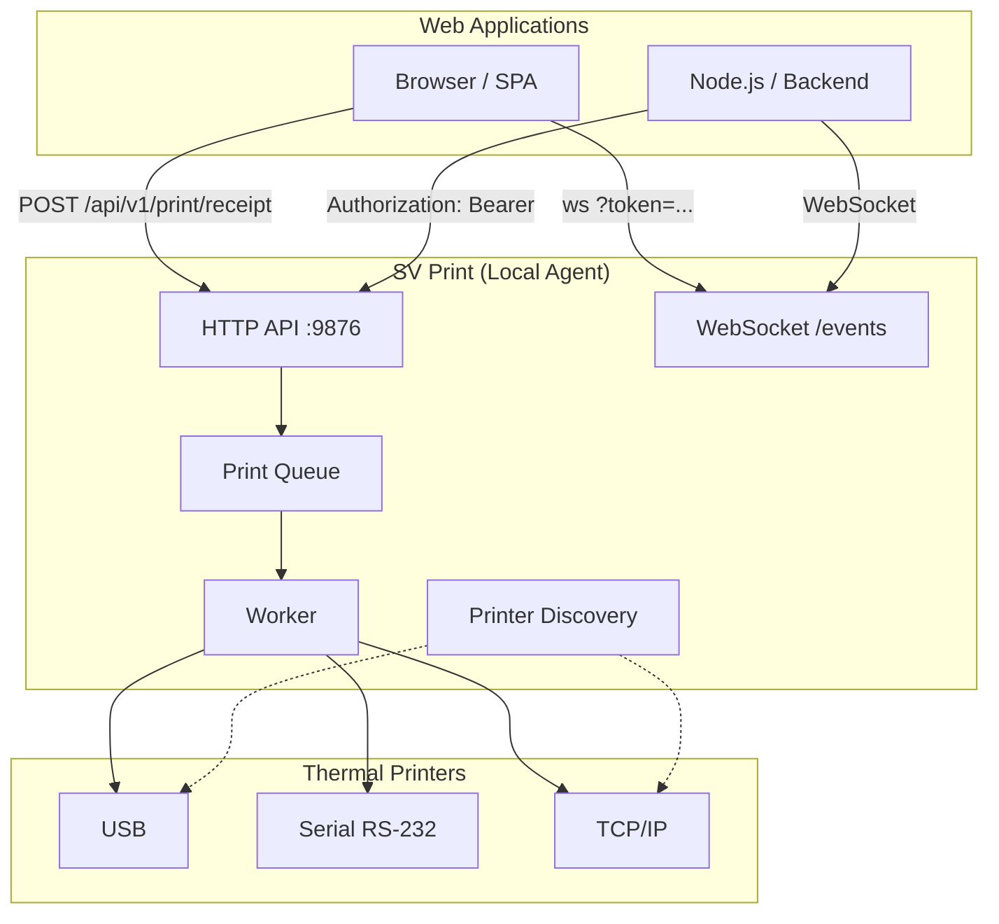

<h1 align="center">SV Printer</h1>

<p align="center">
  
</p>

<p align="center">
  <b>Cross-platform local agent written in Go that lets web applications print to thermal printers — without relying on the browser's print dialog.</b>
</p>

<p align="center">
  <a href="LICENSE"></a>
  <a href="https://golang.org/"></a>
  <a href="https://github.com/svtech-code/sv-printerer/actions/workflows/ci.yml"></a>
  <a href="https://github.com/svtech-code/sv-printerer/releases"></a>
  <a href="#licensing"></a>
  <a href="README_ES.md"></a>
</p>

<p align="center">
  <a href="#key-features">Features</a> •
  <a href="#architecture">Architecture</a> •
  <a href="#quickstart">Quickstart</a> •
  <a href="#local-api">API</a> •
  <a href="#licensing">Licensing</a> •
  <a href="#integration">Integration</a> •
  <a href="#development">Development</a>
</p>

---

## Quick Links

> **New to SV Print?** Check out the full [Integration Guide](./documentation/integration.md) ([Español](./documentation/integration_ES.md)), the [Licensing Guide](./documentation/licensing.md), or the [Client Examples](./examples/) (JavaScript, Python, PHP).
>
> The canonical specification lives in [`documentation/spect.md`](./documentation/spect.md) ([Español](./documentation/spect_ES.md)).

---

## Key Features

| Category | Feature | Description |
|:---|:---|:---|
| **Cross-platform** | Runs on Linux, macOS, and Windows | Single Go binary, no external dependencies |
| **Protocol** | **ESC/POS** native support | Full command set for thermal receipt printers |
| **Transports** | USB, Serial, TCP | Auto-detection or manual configuration |
| **Local API** | REST + WebSocket on `127.0.0.1:9876` | Authenticated, never binds to `0.0.0.0` |
| **Real-time** | **WebSocket events** (pro) | `print.*`, `agent.status`, `printer.*` streamed live |
| **Licensing** | **Freemium** with Ed25519-signed licenses | Trial → Beta → Full; device binding support |
| **Clients** | JS, Python, PHP examples ready to use | No SDK required — plain HTTP + WebSocket |

---

## Architecture

Clean Architecture with a clear separation of concerns:



```text
cmd/sv-printer/            CLI entry point
internal/
  application/           Use cases (discovery, printing, events)
  domain/                Core models (printer, job, errors)
  infrastructure/        Transports (network/serial/USB) and discovery
  interfaces/http/       Local HTTP API + security middleware
pkg/escpos/              ESC/POS command builder
```

---

## Installation and Configuration

SV Print is designed to be distributed as a native desktop application that runs silently in the background.

### 1. Installation
Depending on your OS, you can use the official native installers:
- **Windows**: Run `SV_Printer_Setup.exe`. It installs to `Program Files`, creates Start Menu shortcuts, and handles clean uninstallation.
- **macOS**: Copy `SV Printer.app` to your Applications folder.
- **Linux / CLI**: Compile and run the native binary directly (`./sv-printer`).

### 2. System Tray
Once running, the application will not open annoying consoles. It will dock silently in your **system tray** (near the clock).
From the tray menu you can:
- **Start with system**: Toggle native OS auto-start so the agent boots when the PC turns on.
- **Copy Token**: Copy your security token to the clipboard.
- **Quit**: Shut down the local server cleanly.

### 3. Configuration (CORS and Token)
For your web applications to print, you must authorize their URLs. The first time the program runs, it generates a security Token and a `config.json` file.

**`config.json` File Paths:**
- **Windows**: `%AppData%\sv-printer\config.json`
- **macOS**: `~/Library/Application Support/sv-printer/config.json`
- **Linux**: `~/.config/sv-printer/config.json`

Edit this file to add your web system's domain to the `allowed_origins` array:
```json
{
  "port": 9876,
  "token": "your_generated_token_here",
  "allowed_origins": [
    "https://your-web-system.com"
  ]
}
```
*Note: After saving changes to this file, you must quit the app from the tray and reopen it to apply the new configuration.*

### Development Mode (CLI)
If you prefer to test or configure it temporarily via the terminal:
```bash
# Build
go build -o sv-printer ./cmd/sv-printer

# Configure manually and run
./sv-printer -token mysecret -origin "https://app.com" -printer "Caja 1@192.168.1.100:9100"
```

### Subcommands

| Command | Description |
|---|---|
| `sv-printer version` | Print version |
| `sv-printer status` | Check agent status |
| `sv-printer printers` | List configured printers |
| `sv-printer config` | Show current config |
| `sv-printer discover` | Re-run printer discovery |
| `sv-printer test <id>` | Send a test receipt |
| `sv-printer print <id> <file.json>` | Print a structured receipt from JSON |
| `sv-printer logs` | Tail log file |
| `sv-printer doctor` | Run diagnostics |
| `sv-printer device-id` | Show device fingerprint (for license binding) |

---

## Local API

The agent exposes a local HTTP API on `127.0.0.1:9876` (configurable) and never
binds to `0.0.0.0` by default. Requests require `Authorization: Bearer <token>`.

| Method | Endpoint | Description |
|---|---|---|
| GET | `/health` | Health check |
| GET | `/api/v1/info` | Agent info (name, version, platform, tier) |
| GET | `/api/v1/printers` | List detected printers |
| POST | `/api/v1/printers/discover` | Re-run discovery |
| GET | `/api/v1/printers/{id}` | Get a printer |
| POST | `/api/v1/printers/{id}/test` | Print a test receipt |
| POST | `/api/v1/print` | Create a raw print job (pro) |
| POST | `/api/v1/print/receipt` | Print a structured receipt |
| GET | `/api/v1/jobs/{id}` | Query a job |
| GET | `/api/v1/events` | WebSocket event stream (pro) |

Errors use structured codes and a JSON envelope: `{"error":{"code","message"}}`.

Full API reference, receipt schema, WebSocket events, and error codes are in the
[Integration Guide](./documentation/integration.md) ([Español](./documentation/integration_ES.md)).

---

## Licensing

SV Print uses a **freemium** model under the [Business Source License 1.1](./LICENSE)
(BSL 1.1). On **2030-09-11** it converts to [Apache License 2.0](https://www.apache.org/licenses/LICENSE-2.0).

| Mode | Activation | Watermark | Daily quota | Pro features |
|---|---|---|---|---|
| **Trial** (default) | none | yes (watermark at start/end of receipts) | 50 prints/day | no |
| **Beta** | signed license with expiry | no | unlimited | depends on `features` |
| **Full** | signed license | no | unlimited | yes |

**Pro features** (require a license): `POST /api/v1/print` (raw ESC/POS) and
`GET /api/v1/events` (WebSocket events).

See [`documentation/licensing.md`](./documentation/licensing.md) ([Español](./documentation/licensing_ES.md)) for
the full guide on issuing and installing licenses.

```bash
# Issue a license (requires the signing private key)
SV_LICENSE_KEY=<hex> go run ./cmd/sv-license sign \
  -customer "ACME" -tier full -features raw_print,websocket \
  > license.key

# Install on the agent
./sv-printer -license ./license.key
```

---

## Integration

Full API reference, receipt schema, WebSocket events, error codes, and
client examples are in the [Integration Guide](./documentation/integration.md)
([Español](./documentation/integration_ES.md)).

Client libraries are in [`examples/`](./examples/) (JavaScript, Python, PHP).

---

## Development

The workflow follows the project conventions recorded in memory:

- **TDD:** write tests after each task and keep them passing (`go test ./...`).
- **Pre-commit gate:** before presenting any commit message, run
  `gofmt -l .`, `go vet ./...`, and `go test ./...` — fix failures first.
- **Standard library first:** avoid external packages when the Go stdlib suffices.
- **Conventional Commits:** commits use `type(scope): message` (English).
- **Spec-driven:** behavior/architecture changes go through the `sv-memory` spec
  flow before implementation.

Useful commands:

```bash
gofmt -l .
go vet ./...
go test ./...
go build ./...
```

---

## Status

Early MVP. The spec is the source of truth; see the Roadmap section
(§43) in [`documentation/spect.md`](./documentation/spect.md) for the phased plan.

---

## License

SV Print is distributed under a freemium license (see [Licensing](#licensing)
above and [`documentation/licensing.md`](./documentation/licensing.md)). The source is proprietary;
see the repository owner for licensing and distribution terms.
