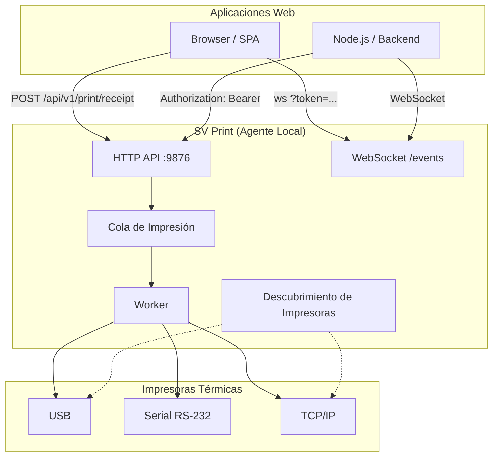

<h1 align="center">SV Print</h1>

<p align="center">
  <b>Agente local multiplataforma escrito en Go que permite a las aplicaciones web imprimir en impresoras térmicas — sin depender del diálogo de impresión del navegador.</b>
</p>

<p align="center">
  <a href="LICENSE"></a>
  <a href="https://golang.org/"></a>
  <a href="https://github.com/svtech-code/sv-printer/actions/workflows/ci.yml"></a>
  <a href="https://github.com/svtech-code/sv-printer/releases"></a>
  <a href="#licencia"></a>
  <a href="README.md"></a>
</p>

<p align="center">
  <a href="#características-clave">Características</a> •
  <a href="#arquitectura">Arquitectura</a> •
  <a href="#inicio-rápido">Inicio Rápido</a> •
  <a href="#api-local">API</a> •
  <a href="#licencia">Licencia</a> •
  <a href="#integración">Integración</a> •
  <a href="#desarrollo">Desarrollo</a>
</p>

---

## Enlaces Rápidos

> **¿Nuevo en SV Print?** Consulta la [Guía de Integración](./documentation/integration_ES.md) ([English](./documentation/integration.md)), la [Guía de Licencias](./documentation/licensing_ES.md) o los [Ejemplos de Clientes](./examples/) (JavaScript, Python, PHP).
>
> La especificación canónica vive en [`documentation/spect_ES.md`](./documentation/spect_ES.md) ([English](./documentation/spect.md)).

---

## Características Clave

| Categoría | Característica | Descripción |
|:---|:---|:---|
| **Multiplataforma** | Funciona en Linux, macOS y Windows | Binario único de Go, sin dependencias externas |
| **Protocolo** | **ESC/POS** nativo | Comando completo para impresoras térmicas de recibos |
| **Transportes** | USB, Serial, TCP | Auto-detección o configuración manual |
| **API Local** | REST + WebSocket en `127.0.0.1:9876` | Autenticada, nunca se vincula a `0.0.0.0` |
| **Tiempo real** | **Eventos WebSocket** (pro) | `print.*`, `agent.status`, `printer.*` transmitidos en vivo |
| **Licencias** | **Freemium** con licencias firmadas Ed25519 | Trial → Beta → Full; soporte de vinculación a dispositivo |
| **Clientes** | Ejemplos JS, Python, PHP listos para usar | Sin SDK requerido — HTTP + WebSocket puros |

---

## Arquitectura

Clean Architecture con separación clara de responsabilidades:



```text
cmd/sv-print/            Punto de entrada CLI
internal/
  application/           Casos de uso (descubrimiento, impresión, eventos)
  domain/                Modelos centrales (impresora, trabajo, errores)
  infrastructure/        Transportes (red/serial/USB) y mecanismos de descubrimiento
  interfaces/http/       API HTTP local + middleware de seguridad
pkg/escpos/              Constructor de comandos ESC/POS
```

---

## Inicio Rápido

```bash
# Compilar
go build -o sv-print ./cmd/sv-print

# Ejecutar (auto-detecta impresoras, genera un token en la primera ejecución)
./sv-print

# O configurar manualmente
./sv-print -token mysecret -port 9876 -printer "Caja 1@192.168.1.100:9100"
```

### Subcomandos

| Comando | Descripción |
|---|---|
| `sv-print version` | Mostrar versión |
| `sv-print status` | Verificar estado del agente |
| `sv-print printers` | Listar impresoras configuradas |
| `sv-print config` | Mostrar configuración actual |
| `sv-print discover` | Redescubrir impresoras |
| `sv-print test <id>` | Enviar un recibo de prueba |
| `sv-print print <id> <archivo.json>` | Imprimir un recibo estructurado desde JSON |
| `sv-print logs` | Seguir archivo de log |
| `sv-print doctor` | Ejecutar diagnósticos |
| `sv-print device-id` | Mostrar huella del dispositivo (para vinculación de licencia) |

---

## API Local

El agente expone una API HTTP local en `127.0.0.1:9876` (configurable) y nunca
se vincula a `0.0.0.0` por defecto. Las peticiones requieren `Authorization: Bearer <token>`.

| Método | Endpoint | Descripción |
|---|---|---|
| GET | `/health` | Salud del agente |
| GET | `/api/v1/info` | Info del agente (nombre, versión, plataforma, tier) |
| GET | `/api/v1/printers` | Listar impresoras detectadas |
| POST | `/api/v1/printers/discover` | Redescubrir impresoras |
| GET | `/api/v1/printers/{id}` | Obtener una impresora |
| POST | `/api/v1/printers/{id}/test` | Imprimir recibo de prueba |
| POST | `/api/v1/print` | Crear trabajo de impresión raw (pro) |
| POST | `/api/v1/print/receipt` | Imprimir recibo estructurado |
| GET | `/api/v1/jobs/{id}` | Consultar un trabajo |
| GET | `/api/v1/events` | Flujo de eventos WebSocket (pro) |

Los errores usan códigos estructurados y un envoltorio JSON: `{"error":{"code","message"}}`.

La referencia completa de la API, el esquema de recibos, los eventos WebSocket y los
códigos de error están en la [Guía de Integración](./documentation/integration_ES.md)
([English](./documentation/integration.md)).

---

## Licencia

SV Print usa un modelo **freemium** bajo la [Licencia Comercial 1.1](./LICENSE)
(BSL 1.1). El **11/09/2030** se convierte a la [Licencia Apache 2.0](https://www.apache.org/licenses/LICENSE-2.0).

| Modo | Activación | Marca de agua | Cuota diaria | Funciones pro |
|---|---|---|---|---|
| **Trial** (por defecto) | ninguno | sí (al inicio y final de recibos) | 50 impresiones/día | no |
| **Beta** | licencia firmada con expiración | no | ilimitado | según `features` |
| **Full** | licencia firmada | no | ilimitado | sí |

**Funciones pro** (requieren licencia): `POST /api/v1/print` (ESC/POS raw) y
`GET /api/v1/events` (eventos WebSocket).

Consulta [`documentation/licensing_ES.md`](./documentation/licensing_ES.md) ([English](./documentation/licensing.md))
para la guía completa de emisión e instalación de licencias.

```bash
# Emitir una licencia (requiere la clave privada de firma)
SV_LICENSE_KEY=<hex> go run ./cmd/sv-license sign \
  -customer "ACME" -tier full -features raw_print,websocket \
  > license.key

# Instalar en el agente
./sv-print -license ./license.key
```

---

## Integración

La referencia completa de la API, el esquema de recibos, los eventos WebSocket,
los códigos de error y los ejemplos de clientes están en la
[Guía de Integración](./documentation/integration_ES.md) ([English](./documentation/integration.md)).

Las bibliotecas de clientes están en [`examples/`](./examples/) (JavaScript, Python, PHP).

---

## Desarrollo

El flujo de trabajo sigue las convenciones del proyecto registradas en memoria:

- **TDD:** escribir tests después de cada tarea y mantenerlos pasando (`go test ./...`).
- **Puerta de pre-commit:** antes de presentar cualquier mensaje de commit, ejecutar
  `gofmt -l .`, `go vet ./...` y `go test ./...` — corregir fallos primero.
- **Biblioteca estándar primero:** evitar paquetes externos cuando la stdlib de Go alcanza.
- **Conventional Commits:** los commits usan `type(scope): message` (inglés).
- **Spec-driven:** los cambios de comportamiento/arquitectura pasan por el flujo de
  spec de `sv-memory` antes de la implementación.

Comandos útiles:

```bash
gofmt -l .
go vet ./...
go test ./...
go build ./...
```

---

## Estado

MVP temprano. La especificación es la fuente de verdad; consulta la sección Roadmap
(§43) en [`documentation/spect_ES.md`](./documentation/spect_ES.md) para el plan por fases.

---

## Licencia

SV Print se distribuye bajo una licencia freemium (ver [Licencia](#licencia)
arriba y [`documentation/licensing_ES.md`](./documentation/licensing_ES.md)). El código fuente es
proprietario; consulta al propietario del repositorio para términos de licencia
y distribución.
